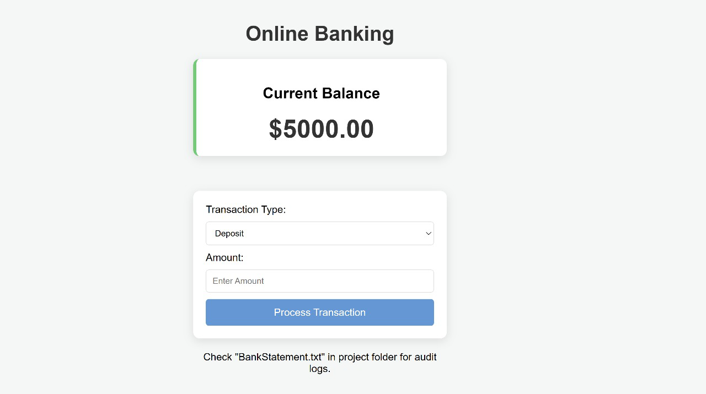

# Banking-System
# Automated Banking & ATM Simulation

## Overview
The Automated Banking & ATM Simulation is a full-stack project designed to demonstrate secure financial transaction processing. Built using Core Java for the backend and HTML/CSS for the frontend, this application simulates a real-world banking environment. It features a custom HTTP server built from scratch (without frameworks like Spring or Tomcat) to handle web requests, ensuring a deep understanding of HTTP protocols, multithreading, and file handling.

## Features
* **Account Management:** Real-time balance inquiry and updates.
* **Transaction Module:** Supports Deposits and Withdrawals with instant reflection on the dashboard.
* **Concurrency Control:** Uses Java `synchronized` blocks to prevent race conditions (thread safety).
* **Audit Logging:** Automatically writes all transaction details to a `BankStatement.txt` file (File I/O).
* **Custom Exception Handling:** Detects and reports errors like `InsufficientFundsException`.
* **Web Interface:** A clean, responsive dashboard built with HTML5 and CSS3.

## Technologies/Tools Used
* **Language:** Java (JDK 8 or later)
* **Frontend:** HTML5, CSS3
* **Server:** Java `com.sun.net.httpserver` (Built-in HTTP Server)
* **Version Control:** Git & GitHub
* **IDE:** VS Code / IntelliJ IDEA / Notepad++

## Steps to Install & Run the Project

### Prerequisites
* Java Development Kit (JDK) installed.
* Git installed (optional, for cloning).

### Installation
1.  **Clone the repository:**
    ```bash
    git clone [https://github.com/specter17/Banking-System-Java.git](https://github.com/specter17/Banking-System-Java.git)
    cd Banking-System-Java
    ```

2.  **Compile the Java Backend:**
    Open your terminal/command prompt in the project root folder and run:
    ```bash
    javac -d bin src/banking/exceptions/*.java src/banking/utils/*.java src/banking/core/*.java src/banking/server/*.java
    ```

3.  **Start the Server:**
    Run the following command to start the application:
    ```bash
    java -cp bin banking.server.BankingServer
    ```

4.  **Access the Application:**
    Open your web browser (Chrome/Edge/Firefox) and navigate to:
    `http://localhost:8000`

## Instructions for Testing
To verify the system is working correctly, perform the following tests:

1.  **Deposit Test:**
    * Select "Deposit" from the dropdown.
    * Enter Amount: `1000`.
    * Click "Process Transaction".
    * *Expected Result:* Balance increases by 1000, and a success message appears.

2.  **Withdrawal Test (Success):**
    * Select "Withdraw".
    * Enter an amount less than your current balance.
    * Click "Process".
    * *Expected Result:* Balance decreases.

3.  **Exception Handling Test (Failure):**
    * Select "Withdraw".
    * Enter an amount **higher** than your current balance (e.g., 1000000).
    * Click "Process".
    * *Expected Result:* The screen displays "Error: Insufficient Funds" and the balance remains unchanged.

4.  **Audit Log Test:**
    * Go to the project folder.
    * Open `BankStatement.txt`.
    * *Expected Result:* You should see a timestamped log of the actions you just performed.

## Screenshots
*(Optional: Place screenshots in a folder named 'screenshots' and reference them below)*


*Figure 1: The Banking Dashboard Interface*
